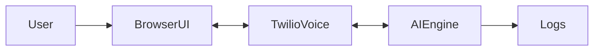

# 🎬 02.DEMO_AGENT.md（CODEX用 仕様テンプレ／自動生成対象）

> このファイルは `DEMO_PLANNER.md` から **自動生成** される想定です。  
> CODEX / Claude Code は本ファイルの仕様に沿って、設計→実装→ドキュメント出力を行います。

---

## 🧠 Project Overview
- **Project Name:** <!-- auto-from planner or set explicitly -->
- **Demo Type:** <!-- e.g., Scenario + Tech -->
- **Target Audience:** <!-- who -->
- **Expected Wow:** <!-- Experiential / Technical / Conceptual / Visionary / etc. -->
- **Core Purpose (1 sentence):** <!-- crisp one-liner -->

---

## 🧩 Technical Context
- **Platform:** <!-- Twilio Functions & Assets / Node.js / Cloud Run -->
- **APIs / Services:** <!-- Twilio Voice, Realtime API, Whisper.cpp, Verify, Flex, Maps, etc. -->
- **Frontend:** <!-- HTML/JS or React/Tailwind -->
- **Backend:** <!-- Functions-only / Node+Express -->
- **Data Handling:** <!-- Realtime stream / Sync / none -->
- **Constraints / NFRs:** <!-- latency, stability, offline, etc. -->

---

## 🗺️ System Architecture
### 1) Mermaid 構成図（必須）

> ※ 実際の構成に合わせてAIが詳細化

### 2) 主フロー（時系列）
1. <!-- call setup -->
2. <!-- media stream start -->
3. <!-- STT/translation/TTS -->
4. <!-- render to UI / send SMS -->
5. <!-- teardown -->

---

## 🎨 UX / UI
- **UI Mood:** <!-- ex: clean, modern -->
- **Key Screens / States:** <!-- bullets -->
- **Accessibility / Mobile:** <!-- if any -->

---

## 💥 Wow Design
| Wow Type | 狙い | 実装ポイント |
|----------|------|--------------|
| <!-- Experiential --> | <!-- 没入体験 --> | <!-- real phone no., live SMS --> |
| <!-- Technical --> | <!-- 低遅延/新奇性 --> | <!-- realtime pipeline --> |
| <!-- Conceptual --> | <!-- 連携の妙 --> | <!-- Okta+Verify etc. --> |

---

## 🧰 Deliverables（AIが出力）
- [ ] アーキ図（Mermaid/PNG）
- [ ] コード一式（Functions/Assets or Node）
- [ ] `.env.example` と設定手順
- [ ] README（起動/デプロイ/操作）
- [ ] デモ台本（1〜2分/5〜7分の2種）
- [ ] ブログ下書き（Qiita用の見出し構成）

---

## 🔧 Implementation Notes
- **Env Vars:** <!-- TWILIO_ACCOUNT_SID, AUTH_TOKEN, SERVICE_SIDs, etc. -->
- **Provisioning:** <!-- phone numbers, messaging service, domains -->
- **Testing:** <!-- local test, mock, recorded-mode -->
- **Fallbacks:** <!-- degraded-mode, offline demo -->
- **Metrics / Logging:** <!-- console, Sync, Segment etc. -->

---

## 📜 Compliance / Legal
- **PII / Recording Policy:** <!-- -->
- **Telecom / Numbering:** <!-- -->
- **Brand / Disclaimer:** <!-- -->

---

## 🗓️ Timeline
- **Milestones:** <!-- dates -->
- **Rehearsal Plan:** <!-- dry-runs -->

---

## 🔄 Conversion Rules（PLANNER → AGENT 自動変換の指示）
> 変換用AIは以下のマッピングで `DEMO_PLANNER.md` を要約・補完し、空欄は推定で埋めること。

- `1.目的` → **Core Purpose** / **KPI**（READMEに記載）  
- `2.タイプ & Wow設計` → **Demo Type** / **Expected Wow** / **Wow Design**  
- `3.ターゲット & 利用シーン` → **Target Audience** / **UX** / **Story**  
- `4.技術スタック / 制約` → **Platform / APIs / Constraints**  
- `5.デモ体験フロー` → **System Architecture（主フロー）**  
- `6.リスク & 代替案` → **Fallbacks / Testing / Notes**  
- `7.成果物 & スコープ` → **Deliverables**  
- `8.リハーサル & オペ**` → **Timeline / Rehearsal**  
- `9.法務**` → **Compliance**  
- `10.付録` → **README References**

---

### ✅ ChatGPT/Claude への指示例（コピペ用）
> 「`DEMO_PLANNER.md` を読み込み、上記 **Conversion Rules** に従って `DEMO_AGENT.md` を生成してください。  
> 不足箇所は合理的に推定し、推定値には `<!-- TBD: ... -->` のコメントを付けてください。」
