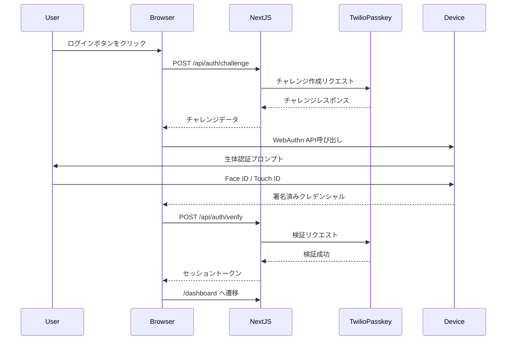
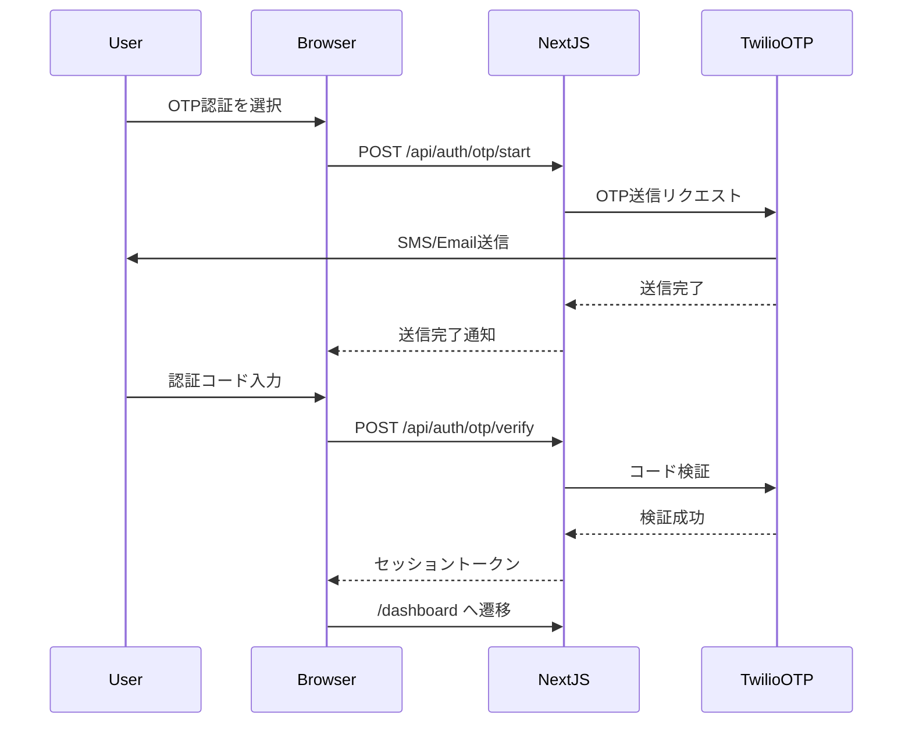
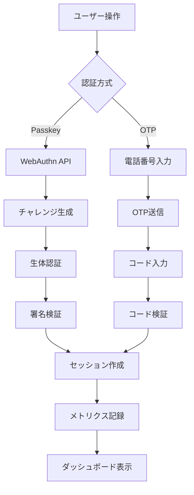
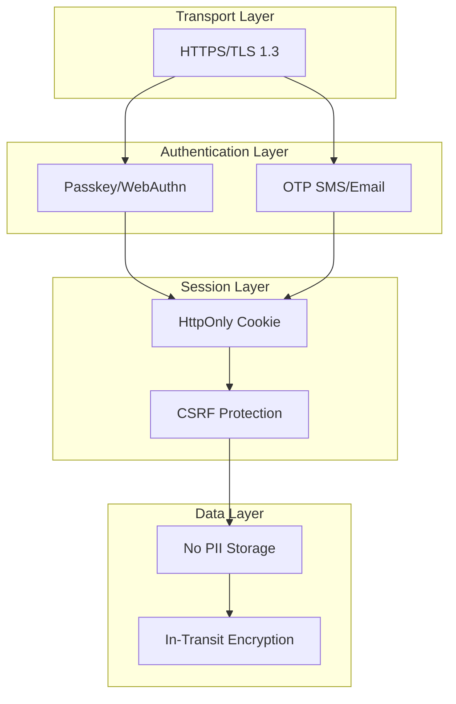

# アーキテクチャ図

## システム構成図

```mermaid
flowchart LR
  User((Booth Visitor))
  subgraph Device[Visitor Device]
    Browser[Browser UI (Next.js)]
  end

  subgraph Vercel[Vercel]
    App[Next.js App (App Router)]
    API[API Routes (Serverless/Edge)]
    CDN[(Edge Network/CDN)]
    Metrics[Vercel Analytics / Logs]
  end

  subgraph Twilio[Twilio]
    Passkey[Verify Passkey (Beta)]
    OTP[Verify OTP (SMS/Email)]
  end

  User --> Browser
  Browser <--> CDN
  CDN <--> App
  App <--> API
  API <--> Passkey
  API <--> OTP
  App --> Metrics
  API --> Metrics

  classDef svc fill:#eef,stroke:#99f;
  classDef ext fill:#efe,stroke:#6c6;

  class App,API,CDN,Metrics svc
  class Passkey,OTP ext
```

## 認証フロー（パスキー）



## 認証フロー（OTPフォールバック）



## データフロー



## コンポーネント構成

```
┌─────────────────────────────────────┐
│         Browser (Client)            │
├─────────────────────────────────────┤
│  Pages:                             │
│  ├── Home (page.tsx)                │
│  └── Dashboard (dashboard/page.tsx) │
│                                     │
│  Components:                        │
│  ├── AuthModal                      │
│  ├── Toast                          │
│  └── ComparisonPanel                │
└─────────────────────────────────────┘
              ↕
┌─────────────────────────────────────┐
│      Next.js API Routes (Edge)      │
├─────────────────────────────────────┤
│  /api/auth/challenge                │
│  /api/auth/verify                   │
│  /api/auth/otp/start                │
│  /api/auth/otp/verify               │
│  /api/session/reset                 │
│  /api/metrics/track                 │
└─────────────────────────────────────┘
              ↕
┌─────────────────────────────────────┐
│         Twilio Services             │
├─────────────────────────────────────┤
│  ├── Verify Passkey (Beta)          │
│  └── Verify OTP                     │
└─────────────────────────────────────┘
```

## セキュリティレイヤー



## デプロイメントアーキテクチャ

```
┌──────────────────────────────────────────┐
│            Vercel Edge Network           │
│  (Global CDN, Auto-scaling)              │
└──────────────────────────────────────────┘
                    ↓
┌──────────────────────────────────────────┐
│         Next.js Application              │
│  Runtime: Edge (低レイテンシ)             │
└──────────────────────────────────────────┘
                    ↓
┌──────────────────────────────────────────┐
│          Twilio API Gateway              │
│  (Multi-region, 99.95% SLA)              │
└──────────────────────────────────────────┘
```

## 技術スタック詳細

### フロントエンド
- **Framework**: Next.js 15 (App Router)
- **Language**: TypeScript 5
- **Styling**: Tailwind CSS 3.4
- **UI State**: React Hooks (useState, useEffect)
- **WebAuthn**: Browser Native API

### バックエンド
- **Runtime**: Vercel Edge Functions
- **API**: Next.js Route Handlers
- **Session**: Cookie-based (HttpOnly, Secure)
- **Validation**: TypeScript型チェック

### 外部サービス
- **Authentication**: Twilio Verify Passkey (Beta)
- **OTP**: Twilio Verify (SMS/Email)
- **Hosting**: Vercel
- **Analytics**: Vercel Analytics

### 開発ツール
- **Package Manager**: npm
- **Linting**: ESLint
- **Version Control**: Git

## パフォーマンス最適化

### エッジコンピューティング
- API Routes を Edge Runtime で実行
- グローバルCDNによる低レイテンシ配信
- 静的アセットの積極的キャッシング

### コード最適化
- Tree-shaking による不要コードの削除
- Dynamic imports による遅延ロード
- Image optimization (Next.js Image component)

### ネットワーク最適化
- HTTP/2 & HTTP/3 サポート
- Brotli/Gzip 圧縮
- DNS Prefetch
- Preconnect to Twilio API

## スケーラビリティ

### 水平スケーリング
- Vercel の自動スケーリング
- ステートレス設計（セッションはクライアント側Cookie）
- CDNによる分散配信

### 垂直スケーリング
- Edge Functions の自動リソース調整
- Twilioのマネージドインフラ

## 監視とロギング

### メトリクス
- リクエスト数、レスポンスタイム
- 認証成功率、失敗率
- エラーレート

### ログ
- API呼び出しログ
- エラーログ
- セキュリティイベントログ

### アラート
- エラー率閾値超過
- レスポンスタイム劣化
- Twilio API障害
