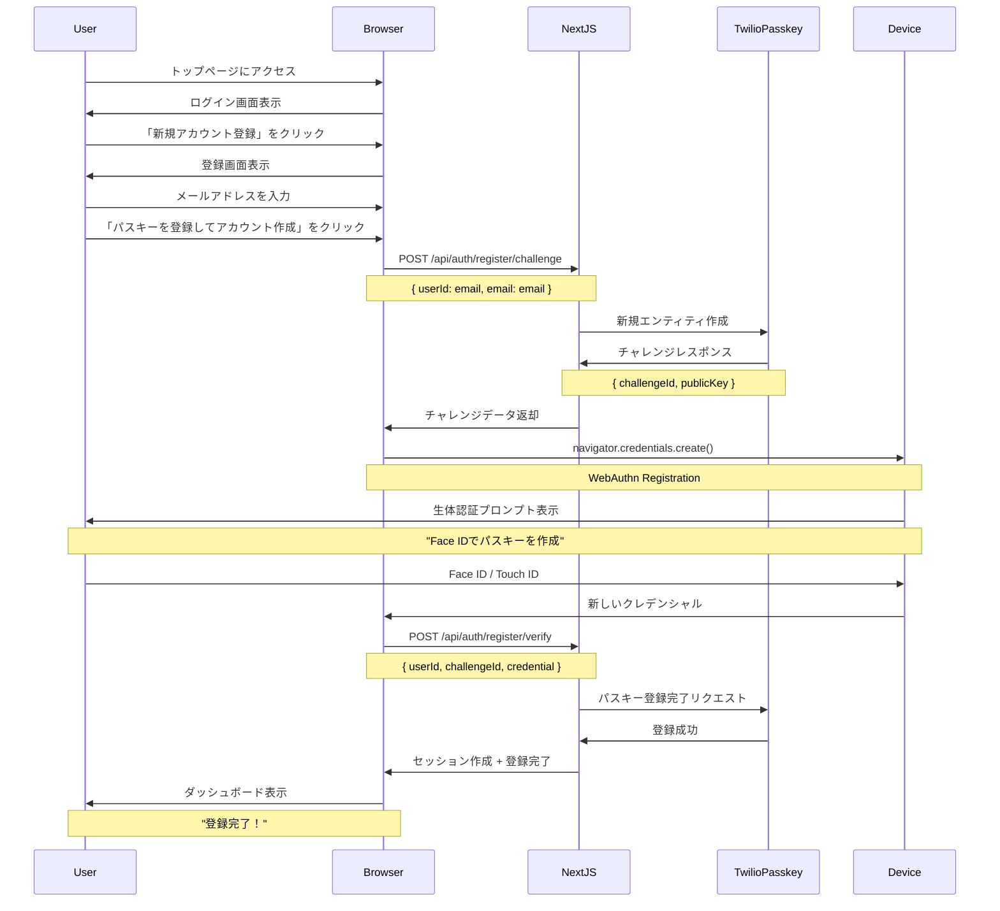
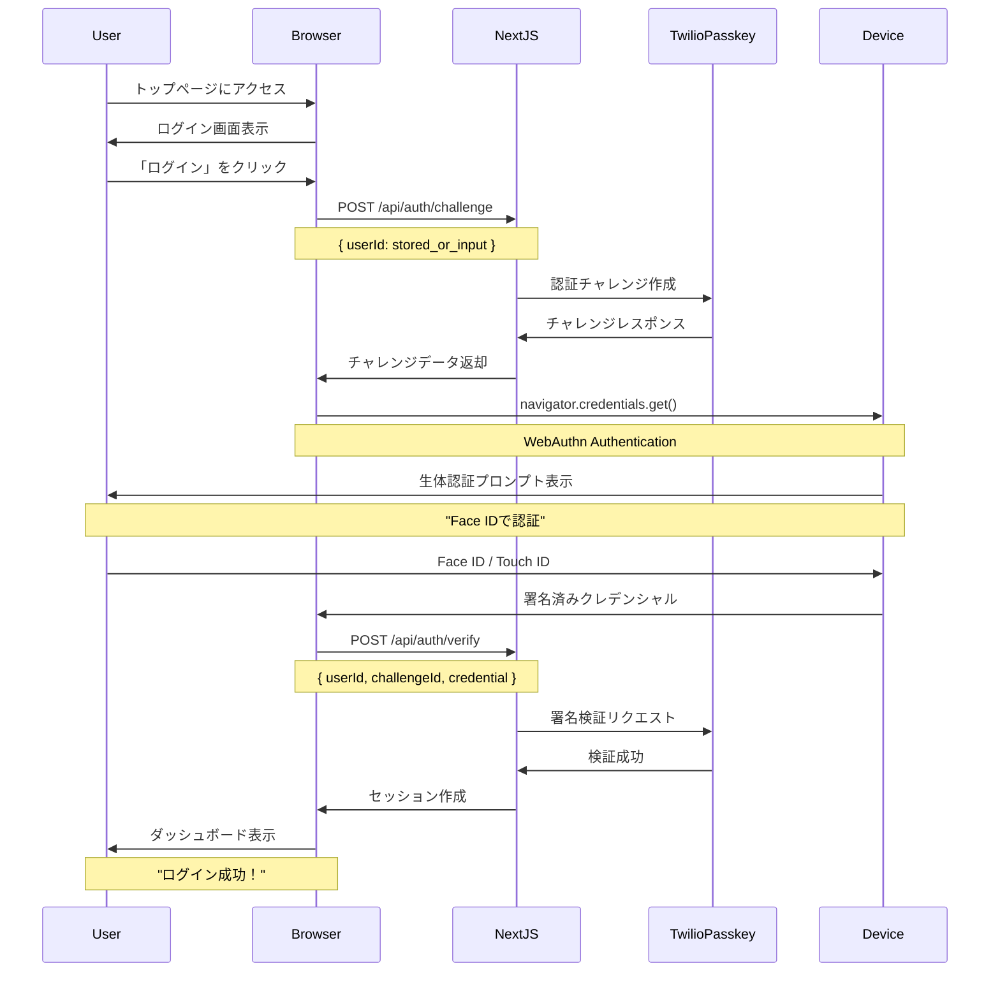
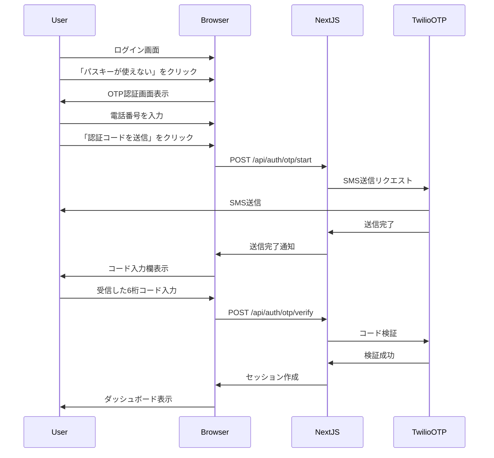

# ユーザーフロー詳細

## 完全なユーザージャーニー

### フロー1: 新規ユーザー登録



### フロー2: 既存ユーザーログイン



### フロー3: OTPフォールバック（パスキー非対応時）



## 画面遷移図

```
┌─────────────────┐
│   トップページ   │
│  (page.tsx)     │
└────────┬────────┘
         │
    ┌────┴────┐
    │         │
    ▼         ▼
┌─────────┐ ┌──────────────┐
│ ログイン │ │ 新規登録      │
│ (既存)   │ │ (register)   │
└────┬────┘ └──────┬───────┘
     │             │
     │ 生体認証     │ メール入力
     │             │ ↓ 生体認証
     │             │ (パスキー作成)
     └─────┬───────┘
           │
           ▼
    ┌──────────────┐
    │ ダッシュボード │
    │ (dashboard)  │
    └──────────────┘
           │
           │ リセット
           ▼
    ┌──────────────┐
    │ トップページ   │
    └──────────────┘
```

## データフロー

### 新規登録時に保存されるデータ

1. **Twilioに保存**:
   - Entity (ユーザーID)
   - Passkey (公開鍵、クレデンシャルID)
   - 登録デバイス情報

2. **ブラウザに保存**:
   - パスキー（秘密鍵）
   - デバイスの認証器に安全に保管

3. **セッションCookieに保存**:
   - userId
   - authenticatedAt
   - loginDuration

### ログイン時の認証フロー

1. **チャレンジ生成**: Twilioがランダムなチャレンジ文字列を生成
2. **署名作成**: デバイスの秘密鍵でチャレンジに署名
3. **署名検証**: Twilioが公開鍵で署名を検証
4. **セッション作成**: 検証成功時にセッションCookie発行

## 状態管理

### セッション状態

```typescript
interface SessionData {
  userId: string;           // ユーザー識別子
  authenticatedAt: number;  // 認証時刻（Unix timestamp）
  loginDuration?: number;   // ログイン所要時間（ms）
}
```

### Cookie設定

- **名前**: `passkey_demo_session`
- **HttpOnly**: `true` (XSS対策)
- **Secure**: `true` (本番環境、HTTPS必須)
- **SameSite**: `lax` (CSRF対策)
- **MaxAge**: `3600` (1時間)

## エラーハンドリング

### パスキー登録失敗時

1. **ブラウザ非対応**:
   - エラーメッセージ: "お使いのブラウザはパスキーに対応していません"
   - フォールバック: OTP認証へ誘導

2. **生体認証キャンセル**:
   - エラーメッセージ: "認証がキャンセルされました"
   - アクション: 再試行ボタン表示

3. **Twilio APIエラー**:
   - エラーメッセージ: "登録に失敗しました。しばらくしてから再試行してください"
   - ログ: サーバーログに詳細を記録

### ログイン失敗時

1. **パスキーが見つからない**:
   - エラーメッセージ: "このデバイスにパスキーが登録されていません"
   - フォールバック: 新規登録またはOTPへ誘導

2. **署名検証失敗**:
   - エラーメッセージ: "認証に失敗しました"
   - アクション: 再試行またはOTPへ誘導

3. **ネットワークエラー**:
   - エラーメッセージ: "ネットワークエラーが発生しました"
   - アクション: リトライボタン表示

## セキュリティ考慮事項

### 登録時

- ✅ メールアドレスの形式検証
- ✅ HTTPS必須（localhostは例外）
- ✅ Origin検証（RP IDとの一致）
- ✅ タイムアウト設定（60秒）

### 認証時

- ✅ チャレンジの使い捨て（replay攻撃対策）
- ✅ 署名検証（公開鍵暗号）
- ✅ セッションの有効期限管理
- ✅ HttpOnly Cookie（XSS対策）

### データ保護

- ✅ 秘密鍵はデバイス内に保管、外部に出ない
- ✅ PII（個人情報）はサーバーに保存しない（デモ環境）
- ✅ ログは匿名化

## ブース運用での特別考慮

### 高速リセット

- **目的**: 次の来場者のために状態をクリア
- **実装**: ダッシュボードの「リセット」ボタン
- **動作**: 
  1. セッションCookie削除
  2. トップページへリダイレクト
  3. 5秒以内に完了

### デモ用の簡略化

- **ユーザー管理**: 実際のDB不要、Twilioのエンティティのみ
- **エラー処理**: 分かりやすいメッセージ優先
- **タイムアウト**: 短め設定（60秒）

## 実装のベストプラクティス

### WebAuthn実装

本番環境では`@simplewebauthn/browser`と`@simplewebauthn/server`を使用:

```typescript
// 登録時（ブラウザ）
import { startRegistration } from '@simplewebauthn/browser';
const credential = await startRegistration(options);

// 認証時（ブラウザ）
import { startAuthentication } from '@simplewebauthn/browser';
const assertion = await startAuthentication(options);

// 検証時（サーバー）
import { verifyRegistrationResponse, verifyAuthenticationResponse } from '@simplewebauthn/server';
const verification = await verifyRegistrationResponse({...});
```

### Twilio Verify Passkey API

正しいAPI呼び出しシーケンス（実際のAPI仕様に準拠）:

```typescript
// 1. 新規エンティティとパスキー作成
const factor = await twilioClient.verify.v2
  .services(SERVICE_SID)
  .entities(userId)
  .newFactors.create({
    friendlyName: `Passkey for ${email}`,
    factorType: 'webauthn',
  });

// 2. パスキー登録完了
const updated = await twilioClient.verify.v2
  .services(SERVICE_SID)
  .entities(userId)
  .newFactors(factor.sid)
  .update({
    authPayload: JSON.stringify(credential),
  });

// 3. 認証チャレンジ作成
const challenge = await twilioClient.verify.v2
  .services(SERVICE_SID)
  .entities(userId)
  .challenges.create({
    factorSid: factor.sid,
  });

// 4. 認証検証
const verified = await twilioClient.verify.v2
  .services(SERVICE_SID)
  .entities(userId)
  .challenges(challenge.sid)
  .update({
    authPayload: JSON.stringify(assertion),
  });
```

## トラブルシューティングガイド

| 症状 | 原因 | 解決策 |
|------|------|--------|
| パスキー登録できない | ブラウザ非対応 | 最新版Chrome/Safari/Edgeを使用 |
| 生体認証が出ない | デバイスに生体認証未設定 | 設定アプリで有効化 |
| ログインできない | 別デバイスで登録した | 同じデバイスを使用するか新規登録 |
| "Origin mismatch"エラー | RP設定ミス | Twilio ConsoleのOriginを確認 |
| ネットワークエラー | 会場Wi-Fi不安定 | モバイルホットスポットに切替 |
